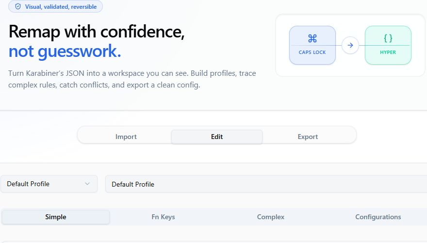

<p align="center">
  
</p>

<h1 align="center">Karabiner Config Editor</h1>

<p align="center">
  A visual workspace for building, validating, and exporting
  <a href="https://karabiner-elements.pqrs.org/">Karabiner-Elements</a> configurations.
</p>

<p align="center">
  <a href="https://karabiner-config-editor.vercel.app/"></a>
  
  
</p>

<p align="center">
  
</p>

## See your configuration, not just its JSON

Karabiner-Elements is wonderfully powerful, but a growing `karabiner.json`
quickly becomes difficult to reason about. Karabiner Config Editor turns that
file into a visual workflow: import what you have, make changes with context,
catch conflicts, and export a clean configuration.

|                         |                                                                                     |
| ----------------------- | ----------------------------------------------------------------------------------- |
| ⌨️ **Visual mappings**  | Work directly with ANSI, ISO, and JIS keyboard layouts.                             |
| 🧩 **Complex rules**    | Build manipulators, conditions, and ordered actions without losing the big picture. |
| 🎯 **Scoped changes**   | Edit simple and fn-key mappings globally, by profile, or for a specific device.     |
| 🛡️ **Safe exports**     | Validate in real time and resolve blocking issues before downloading your config.   |
| ⚡ **Useful templates** | Start quickly with Hyper key, Vim navigation, and other common rule patterns.       |
| 🌗 **Focused UI**       | Use the editor in light or dark mode with a keyboard-first interface.               |

## From file to finished config

1. **Import** an existing `karabiner.json`, paste JSON, or begin with a clean
   default.
2. **Edit** profiles, device mappings, fn keys, complex rules, and Karabiner
   settings.
3. **Review** validation messages and resolve conflicts before they reach your
   keyboard.
4. **Export** the finished JSON as a download or copy it directly to your
   clipboard.

## Quick start

You will need Node.js 18+ and pnpm 9+.

```bash
git clone https://github.com/zkwokleung/karabiner-config-editor.git
cd karabiner-config-editor
pnpm install
pnpm dev
```

Then open [http://localhost:3000](http://localhost:3000).

## Documentation

- 📘 [User guide](./docs/USER_GUIDE.md) — import, edit, validate, and export a
  configuration.
- 🧭 [Architecture](./docs/ARCHITECTURE.md) — data flow, module boundaries, and
  design decisions.
- 🛠️ [Development](./docs/DEVELOPMENT.md) — local setup, conventions, and
  contributor workflow.
- ⚠️ [Validation and limitations](./docs/VALIDATION_AND_LIMITATIONS.md) — rules,
  safeguards, and current constraints.

## Built with

- [Next.js 16](https://nextjs.org/) and React 19
- TypeScript and Tailwind CSS v4
- shadcn/ui and Radix UI primitives
- `@dnd-kit` for drag-and-drop rule ordering
- `react-simple-keyboard` for the visual keyboard

## Project map

```text
src/
  app/                          # App entry, layout, and global styles
  components/
    complex-modifications/      # Complex rule editor and builder
    keyboard/                   # Shared keyboard rendering shell
    mapping/                    # To-event and condition editors
    profile/                    # Profile, device, simple, and fn editors
    ui/                         # UI primitives
  hooks/                        # Shared React hooks
  lib/                          # Validation, constants, and keyboard mappings
  types/                        # Karabiner domain types
docs/                           # Guides and technical documentation
```

## Scripts

| Command             | Description                      |
| ------------------- | -------------------------------- |
| `pnpm dev`          | Start the development server     |
| `pnpm build`        | Create a production build        |
| `pnpm start`        | Run the production server        |
| `pnpm lint`         | Run ESLint                       |
| `pnpm format`       | Format the project with Prettier |
| `pnpm format:check` | Check formatting                 |

Before opening a pull request, run:

```bash
pnpm exec tsc --noEmit
pnpm lint
pnpm format:check
pnpm build
```

## Contributing

Contributions are welcome. Read the [development guide](./docs/DEVELOPMENT.md),
make a focused change, run the quality checks above, and include screenshots for
visible UI changes.

## License

Released under the [MIT License](./LICENSE).
